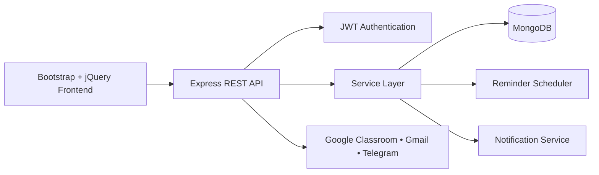
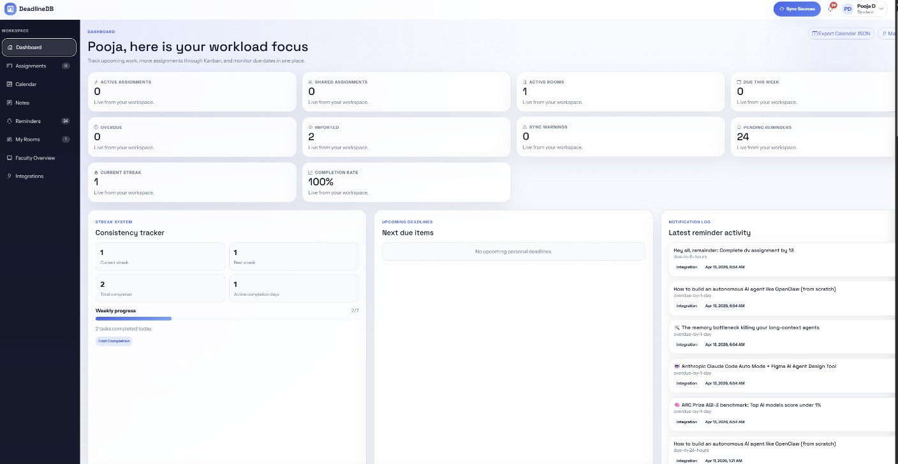
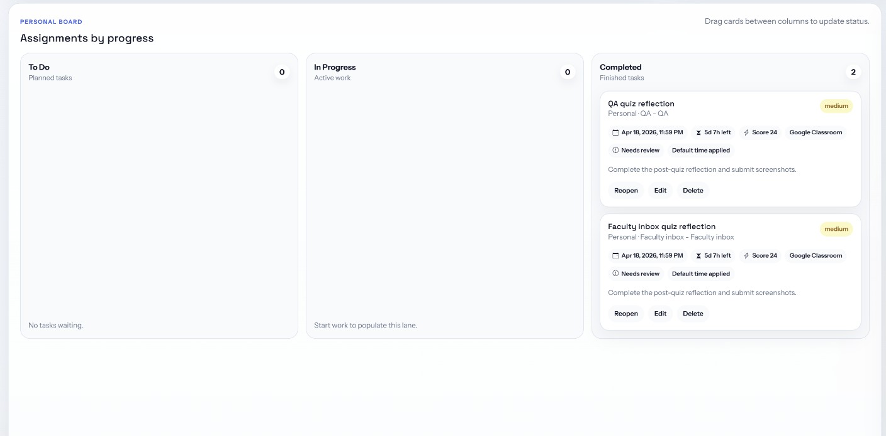
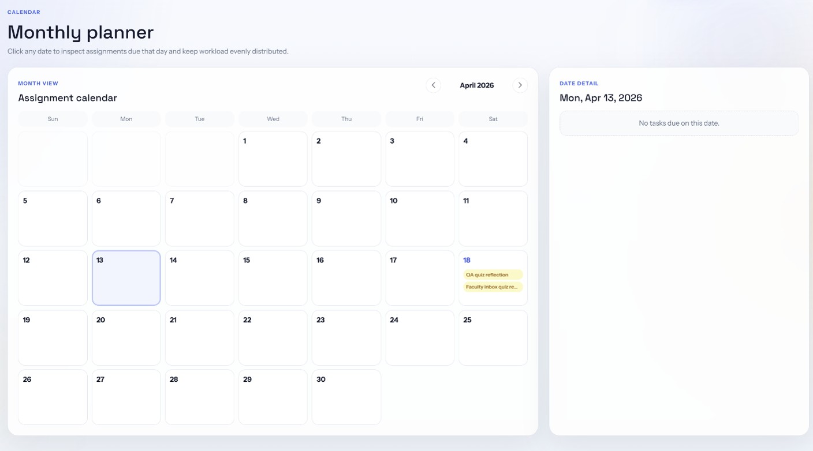
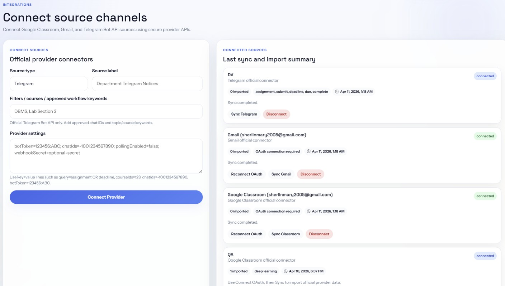

# DeadlineDB

DeadlineDB is a full-stack academic productivity platform that centralizes assignment tracking, deadline management, reminders, and classroom collaboration into a single application. It enables students to organize academic work efficiently while providing faculty with tools to manage assignments, announcements, and student progress through shared workspaces.

---

## 📌 Problem Statement

Students often receive assignment updates from multiple sources such as Telegram, Gmail, Google Classroom, classroom announcements, and handwritten notes. Managing deadlines across these platforms is difficult, leading to missed submissions and poor organization.

DeadlineDB addresses this problem by bringing all academic tasks, reminders, notes, and collaborative classroom activities into one unified platform.

---

##  Key Features

###  Assignment Management
- Create, update, and delete assignments
- Priority-based task organization
- Kanban board for task tracking
- Calendar view for deadlines

###  Smart Reminders
- Manual reminders
- Automatic reminder scheduling
- Overdue task notifications
- Keyword-based reminder detection from notes

###  Shared Academic Rooms
- Create and join rooms using room codes
- Faculty assignment management
- Student progress tracking
- Announcement board
- Shared notes

###  Dashboard & Analytics
- Upcoming deadlines
- Weekly progress
- Completion statistics
- Productivity streaks
- Milestone badges

###  Integrations
- Google Classroom
- Gmail
- Telegram

### Calendar Support
- Export upcoming assignments
- Calendar-friendly JSON/iCal support

---

##  System Architecture



---

##  Tech Stack

### Frontend
- HTML
- CSS
- Bootstrap
- JavaScript
- jQuery
- jQuery UI

### Backend
- Node.js
- Express.js

### Database
- MongoDB
- Mongoose

### Authentication
- JWT (JSON Web Token)

### Other Technologies
- node-cron
- Nodemailer
- Joi Validation
- Helmet
- Express Rate Limiter

---

## 📂 Project Structure

```text
DeadlineDB/
├── docs/
├── public/
├── scripts/
├── src/
│   ├── config/
│   ├── middleware/
│   ├── models/
│   ├── routes/
│   ├── services/
│   ├── utils/
│   └── validation/
├── .env.example
├── package.json
├── package-lock.json
├── README.md
└── server.js
```

---

## 🚀 Getting Started

### Clone the Repository

```bash
git clone https://github.com/your-username/DeadlineDB.git
```

### Navigate to the Project

```bash
cd DeadlineDB
```

### Install Dependencies

```bash
npm install
```

### Create Environment File

Copy `.env.example` and rename it to `.env`.

Update the following variables:

```env
JWT_SECRET=your_jwt_secret
MONGO_URI=your_mongodb_connection_string
```

### Start the Application

```bash
npm start
```

Open your browser and visit:

```
http://localhost:3000
```

---

## Demo Data

To populate the application with sample data:

```bash
npm run seed:demo
```

---

##  Documentation

Detailed documentation is available in the **docs/** folder:

- Deployment Guide
- Demo & Viva Preparation
- Submission Template

---

##  Security Features

- JWT Authentication
- Password Encryption
- Input Validation using Joi
- Request Rate Limiting
- Helmet Security Headers
- Environment Variable Configuration

---

##  Future Enhancements

- Mobile application
- AI-powered deadline extraction
- Push notifications
- Google Calendar synchronization
- Advanced analytics dashboard

---

## 📸 Screenshots

### Dashboard


### Personal Board


### Calendar


### Integrations


---

##  Author

**Alfina Fhobi R**

B.Tech Computer Science and Engineering

Karunya Institute of Technology and Sciences

---

##  License

This project is developed for academic and educational purposes.
