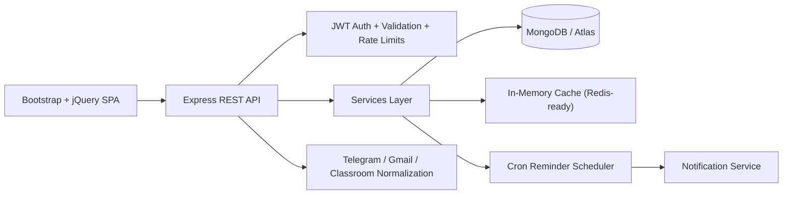

# DeadlineDB

DeadlineDB is a full-stack academic productivity platform that unifies personal deadline tracking with collaborative class workspaces. It helps students manage assignments from Telegram, Gmail, Google Classroom, and manual entries while giving professors and coordinators a shared room system for announcements, deadline communication, and completion visibility.

## Problem Statement

College students often receive assignment updates from scattered channels such as Telegram groups/channels, emails, classroom announcements, and handwritten notes. This causes missed deadlines, duplicated effort, and poor visibility across subjects. DeadlineDB solves that by centralizing deadlines, reminders, notes, and room-based coordination into one dashboard.

## What DeadlineDB Does

- Aggregates assignments from Telegram, Gmail, Google Classroom, and manual input
- Uses official connectors for Google Classroom, Gmail, and Telegram Bot API webhook or polling flows
- Displays workload through a Kanban + calendar hybrid dashboard
- Converts note keywords like `submit`, `deadline`, `due`, and `important` into reminders
- Runs cron-based reminder sweeps for upcoming and overdue tasks
- Tracks streaks, completion rate, and milestone badges
- Supports shared academic rooms for classes, study groups, and faculty coordination
- Separates personal work from shared and official room activity
- Exports upcoming tasks in iCal-friendly JSON format

## Core Modules

- Personal assignment management
- Notes with keyword-triggered reminder detection
- Manual and auto reminders
- Official provider integrations and sync engine
- Notification log pipeline
- Shared rooms and faculty dashboards
- Streaks and gamification
- Calendar export

## Architecture



### Architecture Notes

- The frontend is served from `public/` as a responsive Bootstrap/jQuery single-page app.
- The backend uses Express with route, model, middleware, validation, and service layers.
- MongoDB is the primary datastore; local development can fall back to `mongodb-memory-server`.
- Shared room aggregation and faculty overview are built on top of room, room assignment, announcement, and per-student progress collections.
- Dashboard and export responses use short-lived in-memory caching to reduce repeated aggregation work.

## Tech Stack

- Frontend: HTML, CSS, Bootstrap, JavaScript, jQuery, jQuery UI
- Backend: Node.js, Express
- Database: MongoDB, Mongoose
- Auth: JWT
- Scheduling: `node-cron`
- Email-ready notifications: `nodemailer`
- Security: `helmet`, `express-rate-limit`, input sanitization, Joi validation

## Key Features

### Personal Productivity

- Secure signup/login
- Assignment CRUD with priority scoring
- Kanban board with drag-and-drop
- Calendar deadline visualization
- Manual and auto reminders
- Notes archive with keyword detection
- Streak summary, weekly progress, and badges

### Shared Academic Workspaces

- Create and join rooms using share codes
- Faculty/coordinator room management
- Shared room assignments with per-student progress tracking
- Official announcement board
- Shared notes feed with pinning
- Room analytics and activity logs
- Faculty overview with completion breakdowns and overdue visibility

### Automation and Visibility

- Scheduler detects:
  - due in 24 hours
  - due in 6 hours
  - overdue by 1 day
  - pending reminders
- Notification log preview in dashboard
- Calendar JSON export for upcoming tasks

## Security and Production Readiness

- Joi-based input validation on auth, assignments, reminders, integrations, and room mutations
- Request rate limiting for API and auth routes
- Helmet security headers
- Environment-based CORS policy
- Recursive request sanitization to reduce injection risk
- Centralized JSON logging with log levels
- Standardized error handling middleware
- Environment-driven configuration through `process.env`

## Performance Improvements

- Query-friendly indexes for assignments, reminders, notes, connections, room announcements, and logs
- Short-lived caching for dashboard, faculty overview, room lists/details, and calendar export
- Batch-limited scheduler sweeps via `REMINDER_SWEEP_BATCH_SIZE`
- Frontend lazy room detail loading and request reduction through cached dashboard APIs

## Folder Structure

```text
DeadlineDB/
|-- public/
|   |-- css/
|   |   `-- styles.css
|   |-- js/
|   |   |-- api.js
|   |   |-- auth.js
|   |   `-- dashboard.js
|   `-- index.html
|-- scripts/
|   `-- seedDemo.js
|-- src/
|   |-- config/
|   |   |-- appConfig.js
|   |   `-- db.js
|   |-- middleware/
|   |   |-- auth.js
|   |   |-- errorHandler.js
|   |   |-- notFound.js
|   |   |-- rateLimiters.js
|   |   |-- requestLogger.js
|   |   |-- sanitizeInputs.js
|   |   `-- validate.js
|   |-- models/
|   |-- routes/
|   |-- services/
|   |-- utils/
|   |   `-- logger.js
|   `-- validation/
|       `-- schemas.js
|-- docs/
|   |-- DEMO_AND_VIVA.md
|   |-- DEPLOYMENT.md
|   `-- SUBMISSION_TEMPLATE.md
|-- .env.example
|-- package.json
`-- server.js
```

## API Overview

### Auth

- `POST /api/auth/register`
- `POST /api/auth/login`
- `POST /api/auth/forgot-password`
- `POST /api/auth/reset-password`
- `GET /api/auth/me`

### Personal Modules

- `GET /api/assignments`
- `POST /api/assignments`
- `PUT /api/assignments/:id`
- `DELETE /api/assignments/:id`
- `GET /api/notes`
- `POST /api/notes`
- `GET /api/reminders`
- `POST /api/reminders`
- `PUT /api/reminders/:id`
- `DELETE /api/reminders/:id`

### Dashboard and Notifications

- `GET /api/dashboard/overview`
- `GET /api/notifications`
- `GET /api/exports/calendar`

### Integrations

- `GET /api/integrations`
- `POST /api/integrations`
- `PUT /api/integrations/:id`
- `DELETE /api/integrations/:id`
- `POST /api/integrations/oauth/:provider/start`
- `GET /api/integrations/oauth/google/callback`
- `POST /api/integrations/:id/sync`
- `GET /api/integrations/webhooks/telegram`
- `POST /api/integrations/webhooks/telegram`

### Shared Rooms

- `GET /api/rooms`
- `POST /api/rooms`
- `POST /api/rooms/join`
- `POST /api/rooms/:id/leave`
- `GET /api/rooms/:id`
- `GET /api/rooms/:id/activity`
- `POST /api/rooms/:id/assignments`
- `PUT /api/rooms/:id/assignments/:assignmentId`
- `PUT /api/rooms/:id/assignments/:assignmentId/progress`
- `POST /api/rooms/:id/announcements`
- `PUT /api/rooms/:id/announcements/:announcementId`
- `POST /api/rooms/:id/notes/:noteId/share`
- `PUT /api/rooms/:id/notes/:noteId/pin`
- `GET /api/rooms/faculty/overview`

## Local Setup

1. Install dependencies:

   ```powershell
   npm.cmd install
   ```

2. Create a local environment file:

   ```powershell
   Copy-Item .env.example .env
   ```

3. Set at minimum:

   - `JWT_SECRET`
   - `MONGO_URI` if using Atlas/local Mongo instead of in-memory Mongo

4. Start the app:

   ```powershell
   npm.cmd start
   ```

5. Open [http://localhost:3000](http://localhost:3000)

## Demo Mode

Seed a polished dataset for project evaluation:

```powershell
npm.cmd run seed:demo
```

Or enable automatic seeding on startup by setting:

```env
DEMO_MODE=true
```

Default demo users:

- Student: `student.demo@deadlinedb.local`
- Professor: `prof.demo@deadlinedb.local`
- Password: value of `DEMO_PASSWORD` in `.env` or `.env.example`

The demo seed creates:

- personal assignments and reminders
- one shared room
- shared assignment progress
- official room announcement
- private and shared notes
- notification preview data

## Deployment

See [DEPLOYMENT.md](C:\Users\sherl\OneDrive\Desktop\DeadlineDB\docs\DEPLOYMENT.md) for a full step-by-step guide covering:

- MongoDB Atlas setup
- Render or Railway deployment
- required environment variables
- production checklist

## Demo and Viva Prep

See [DEMO_AND_VIVA.md](C:\Users\sherl\OneDrive\Desktop\DeadlineDB\docs\DEMO_AND_VIVA.md) for:

- a 2 to 3 minute presentation script
- suggested live demo flow
- common viva questions with answers

## Submission Template

See [SUBMISSION_TEMPLATE.md](C:\Users\sherl\OneDrive\Desktop\DeadlineDB\docs\SUBMISSION_TEMPLATE.md) for a simplified README/report outline if you need a separate submission file.

## Suggested Screenshots to Capture

- login and signup screen
- personal dashboard with Kanban and calendar
- notes screen showing reminder detection
- reminders screen
- integrations screen
- My Rooms page
- Room Details page with assignments and announcements
- Faculty Overview page
- demo seed output in terminal

## Production Notes

- Set a strong `JWT_SECRET`
- Use MongoDB Atlas for deployment
- Restrict `CORS_ORIGINS` to deployed frontend origins
- Configure SMTP credentials if real email delivery is required
- Keep `REMINDER_CRON` conservative in production, for example `*/5 * * * *`
- Review the remaining `npm audit` warning before public release
